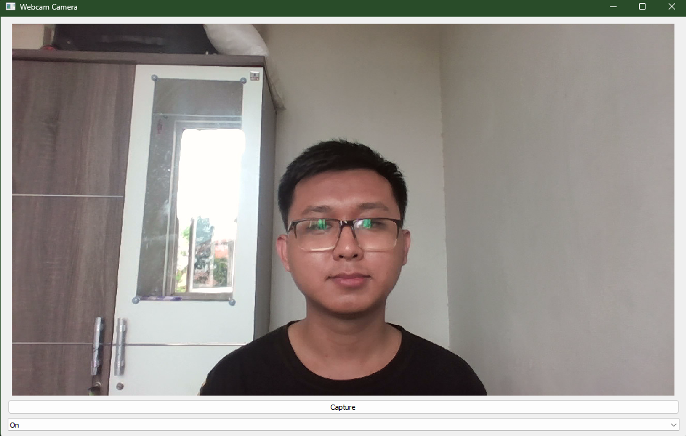

# PyQt5-Camera



## Description

`PyQt5-Camera` is a Python application built with PyQt5 that provides a simple interface to capture photos using a webcam. This application allows users to start and stop the camera, take snapshots, and save them as JPEG files. It utilizes the PyQt5 multimedia framework for camera handling and image capture.

## Features

- Live webcam preview
- Capture and save images
- Toggle camera on/off using a dropdown menu
- User-friendly interface with informative messages

## Requirements

To run the `PyQt5-Camera` application, you will need the following:

- **Python 3.x**: Ensure you have Python 3 installed on your system.
- **PyQt5**: The application uses PyQt5 for the GUI and camera functionalities.

## Setup and Installation

### 1. Clone the Repository

Start by cloning the repository to your local machine:

```bash
git clone https://github.com/Arifmaulanaazis/PyQt5-Camera.git
cd PyQt5-Camera
```

### 2. Create a Virtual Environment

#### Using Anaconda or Miniconda

If you're using Anaconda or Miniconda, create a new environment for the project:

```bash
conda create -n pyqt5-camera python=3.x
conda activate pyqt5-camera
```

Replace `3.x` with your desired Python version.

#### Using Virtualenv (Alternative)

Alternatively, you can use `virtualenv`:

```bash
python -m venv venv
source venv/bin/activate  # On Windows use `venv\Scripts\activate`
```

### 3. Install Dependencies

Install the required packages using `pip`:

```bash
pip install PyQt5
```

If you're using Anaconda or Miniconda, you can also install PyQt5 through Conda:

```bash
conda install pyqt
```

## Running the Application

After setting up the environment and installing dependencies, you can run the application with the following command:

```bash
python main.py
```

A window will appear displaying the live feed from your webcam, along with options to capture an image and toggle the camera on or off.

## Usage

1. **Start Camera**: Select "On" from the dropdown menu to start the camera. The live feed will be displayed in the application window.
2. **Capture Image**: Click the "Capture" button to take a snapshot. The image will be saved as `photo.jpg` in the current directory.
3. **Stop Camera**: Select "Off" from the dropdown menu to stop the camera.

## Contributing

Contributions to the `PyQt5-Camera` project are welcome! If you would like to contribute, please follow these steps:

1. **Fork the Repository**: Click the "Fork" button at the top right of this page to create your own copy of the repository.
2. **Clone Your Fork**: Clone the forked repository to your local machine:

    ```bash
    git clone https://github.com/Arifmaulanaazis/PyQt5-Camera.git
    ```

3. **Create a Branch**: Create a new branch for your changes:

    ```bash
    git checkout -b feature-branch
    ```

4. **Make Changes**: Implement your changes or improvements.
5. **Commit Changes**: Commit your changes with a descriptive message:

    ```bash
    git add .
    git commit -m "Add feature or fix issue"
    ```

6. **Push Changes**: Push your changes to your forked repository:

    ```bash
    git push origin feature-branch
    ```

7. **Open a Pull Request**: Go to the original repository and open a pull request from your forked repository.

## License

This project is licensed under the GPLv3 License - see the [LICENSE](LICENSE) file for details.

## Acknowledgments

- **PyQt5 Documentation**: For detailed information on PyQt5 components and functionalities.
- **GitHub Community**: For providing a platform to share and collaborate on open-source projects.

---
